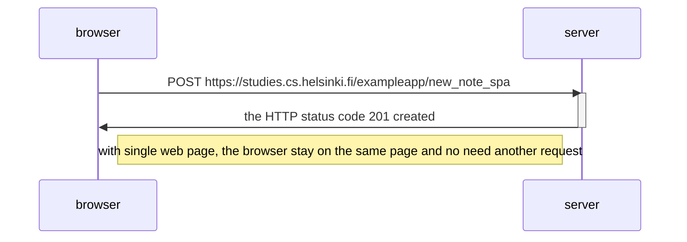

```mermaid
sequenceDiagram
    participant browser
    participant server

    browser->>server: POST https://studies.cs.helsinki.fi/exampleapp/new_note_spa
    activate server
    server->>browser: the HTTP status code 201 created
    deactivate server

    Note right of browser: with single web page, the browser stay on the same page and no need another request
```
